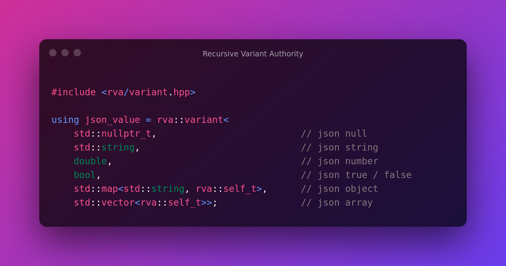

# `rva::variant` — Recursive Sum Types for C++

_Provided by the Recursive Variant Authority. We stand united in opposition to
the [TVA](https://youtu.be/nW948Va-l10). May your variants never be pruned._

Variants are exceedingly useful in C++, but they suffer from a singular and
fundamental shortcoming: unlike sum types in many other languages, there's no
mechanism to define recursive variants in C++.

The Recursive Variant Authority provides a solution in the form of
`rva::variant`, which allows you to write arbitrary recursive sum types with
functionality identical to that provided by `std::variant`.



## Understanding Recursive Variants

To understand what a recursive variant is, and why it's useful, consider
something like a value in json. It can be any of the following:

- A null value
- A string
- A number (usually represented as a double)
- A boolean value (either true or false),
- An object (aka, a map between strings and json values)
- An array of values.

In a language like haskell, we could copy that definition pretty much verbatim
(accounting for syntax, of course):

```hs
data JsonValue = JsonNull
               | JsonBoolean Bool
               | JsonNumber Double
               | JsonStr String
               | JsonObject (Map String JsonValue)
               | JsonArray [JsonValue]
```

It's important to note that `JsonValue` is being used in it's own definition:
it's a recursive type.

## Recursive types in C++

While this may seem a bit strange at first, recursive types aren't all that
unusual. C++ has them too, and it's common for a type to store pointers to
itself in situations such as a binary tree or a linked list. We can even define
`json_value` as a recursive type using a union:

```cpp
class json_value {
    int state = -1;
    union {
        /* state 0 */ std::nullptr_t m_null;
        /* state 1 */ bool m_bool;
        /* state 2 */ double m_number;
        /* state 3 */ std::string m_string;
        /* state 4 */ std::map<std::string, json_value> m_object;
        /* state 5 */ std::vector<json_value> m_array;
    };

   public:
    json_value(std::nullptr_t) : state(0), m_null() {}
    json_value(bool b) : state(1), m_bool(b) {}
    json_value(double d) : state(2), m_number(d) {}
    json_value(std::string const& str) : state(3), m_string(str) {}
    json_value(std::map<std::string, json_value> const& map) : state(4), m_object(map) {}
    json_value(std::vector<json_value> const& arr) : state(5), m_object(m_array) {}

    // Now we need to write move constructors...
    json_value(std::string&& str) : state(3), m_string(std::move(str)) {}
    json_value(std::map<std::string, json_value>&& map) : state(4), m_object(std::move(map)) {}
    json_value(std::vector<json_value>&& arr) : state(5), m_object(std::move(m_array)) {}

    // Now assignment operators...

    // Now comparison operators...

    // .emplace() might be nice

    // Oh hey did we forget copy and move assignment for json_value?

    // maybe we should have a way to check what the index of the currently active element is
};
```

## `std::variant` is only a partial solution

It quickly becomes apparent that the class we're writing is essentially a
specialization of `std::variant`, which (thankfully) simplifies a lot of the
code:

```cpp
class json_value {
    std::variant<
        std::nullptr_t,
        bool,
        double,
        std::string,
        std::map<std::string, json_value>,
        std::vector<json_value>> value;

   public:
    json_value() = default;
    json_value(json_value const&) = default;
    json_value(json_value&&) = default;
    template <class T>
    json_value(T&& object) : value(std::forward<T>(object)) {}


    // Now assignment operators...

    // Now comparison operators...

    // .emplace() might be nice

    // maybe we should have a way to check what the index of the currently active element is
};
```

This is better, and signifigantly less bug prone, but there's still a lot of
boilerplate code that needs to be written.

Here's the thing: at it's core, some types (like json_value) are best expressed
as sum types! Anything we write to wrap one will just be a specialization of a
sum type, and will usually involve a lot of boilerplate code to do the wrapping.

At this point, it might be prudent to ask: can we define `json_value` directly
as a `std::variant`? Would a recursive `using` declaration work? I wish it did.
I really, really wish it did.

```cpp
// LIES!!! This code doesn't work
// error: use of undeclared identifier 'json_value'
using json_value = std::variant<
    std::nullptr_t,                          // json null
    bool,                                    // json boolean
    double,                                  // json number
    std::string,                             // json string
    std::map<std::string, json_value>,       // json object
    std::vector<json_value>>;                // json array
```

## The Recursive Variant Authority provides a complete solution!

`rva::variant` allows you to write recursive variants _without any boilerplate_
by passing `rva::self_t` in the places where you want your recursive type to go!
When you write a statement like this, `rva::variant` will replace instances of
`rva::self_t` with a properly specified instance of it's type, and it does this
as a paper-thin wrapper over `std::variant` that provides all your boilerplate
code for you. And there was a _lot_ of boilerplate code to write.

```cpp
using json_value = rva::variant<
    std::nullptr_t,                       // json null
    bool,                                 // json boolean
    double,                               // json number
    std::string,                          // json string
    std::map<std::string, rva::self_t>,   // json object, type is std::map<std::string, json_value>
    std::vector<rva::self_t>>;            // json array, type is std::vector<json_value>
```

`rva::variant` provides the full set of functionality given by `std::variant`,
including:

- `visit`,
- `get`,
- `get_if`,
- `holds_alternative`,
- `std::variant_size`,
- `std::variant_alternative`,
- `std::hash`)

And it does so as a drop-in replacement (or as close to one as the standard
would allow)!

The Recursive Variant Authority hopes that you enjoy your time using
`rva::variant`, and we encourage you to make full use of it's capabilities when
writing your code.

## Usage & Installation

The most straight-forward way to use `rva::variant` is by using
[CMake's FetchContent interface](https://cmake.org/cmake/help/v3.21/module/FetchContent.html)
to find and fetch the library:

```cmake
FetchContent_Declare(
    rva
    GIT_REPOSITORY https://github.com/codeinred/recursive-variant.git
    GIT_TAG        main
)
FetchContent_MakeAvailable(rva)
```

Alternatively, you can install it as a CMake package like so. _Please note that
it's not necessary to build it in release mode, as it's a header-only library._

```bash
git clone https://github.com/codeinred/recursive-variant.git rva
cd rva
cmake -B build -DBUILD_TESTING=OFF
cmake --build build
sudo cmake --install build
```

Once installed, the library can then be discovered as a CMake package:

```cmake
find_package(rva REQUIRED)
```

In either case, whether obtained via `FetchContent`, or installed as a package,
you can use it via `target_link_libraries`. The library is header-only, but this
will ensure that it's added to the include path for that target.

```cmake
target_link_libraries(<your target> PRIVATE rva::rva)
```

### Running tests

You may have noticed that the installation process "built" the library with
testing off. Installing the library doesn't require running tests, however if
you wish to run them, you may do so by ommitting the flag disabling testing, and
then running `build/test_rva -s`. Testing is done via the
[Catch2 Testing framework](https://github.com/catchorg/Catch2). You will see a
lot of `{?}` in the test output, but that's just because Catch2 doesn't know how
to print a variant.

Tests may be found in the `test/` directory.

```bash
git clone https://github.com/codeinred/recursive-variant.git rva
cd rva
cmake -B build
cmake --build build -j 8
build/test_rva -s
```
